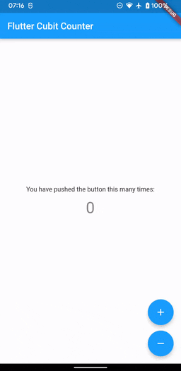

# flutter_cubit_counter

Small app to learn how to use the cubit library coded along with this tutorials:

- [Counter App using Cubit | Flutter Bloc | Flutter State Management](https://www.youtube.com/watch?v=vDdzA4KuFL8)

